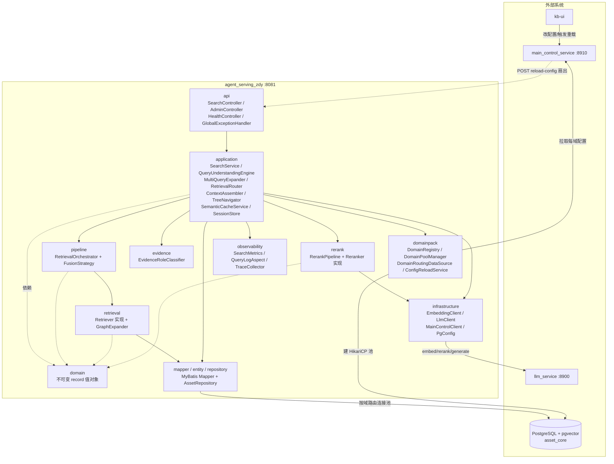
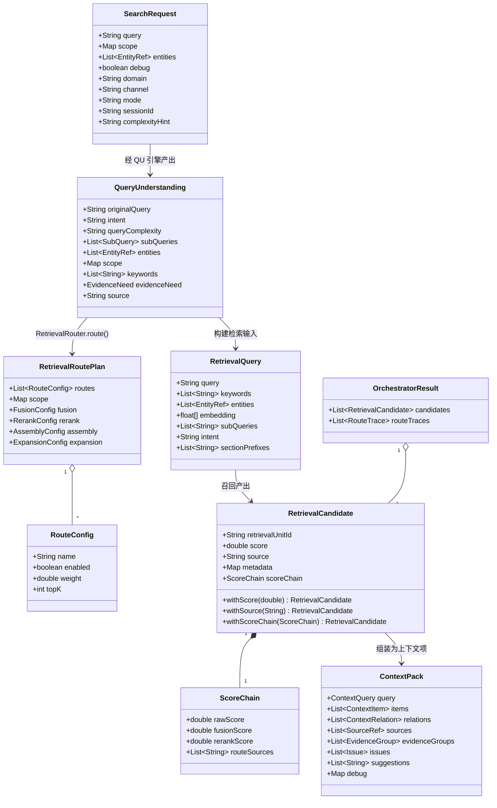
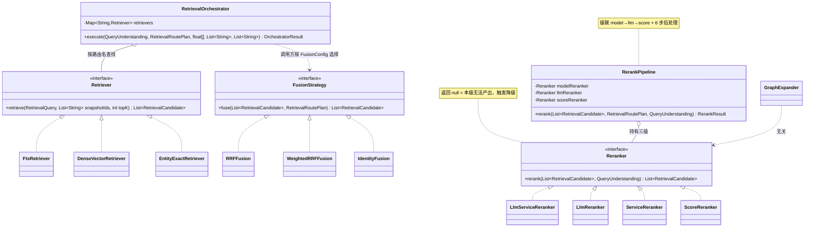
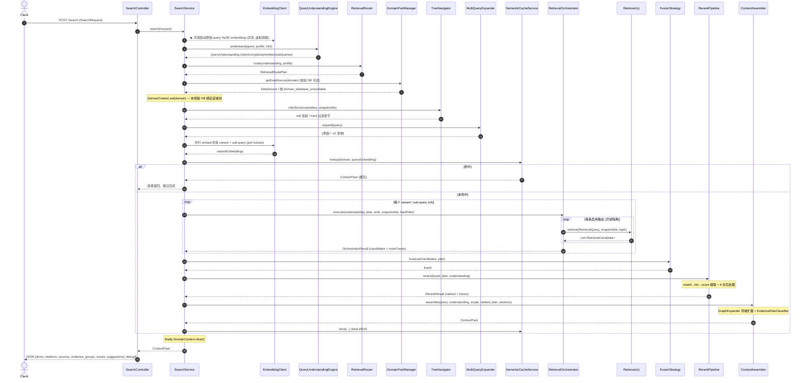
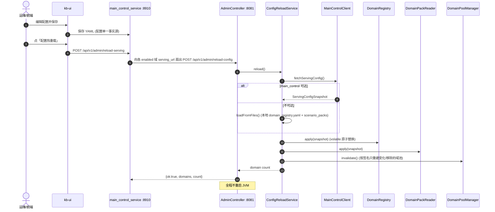
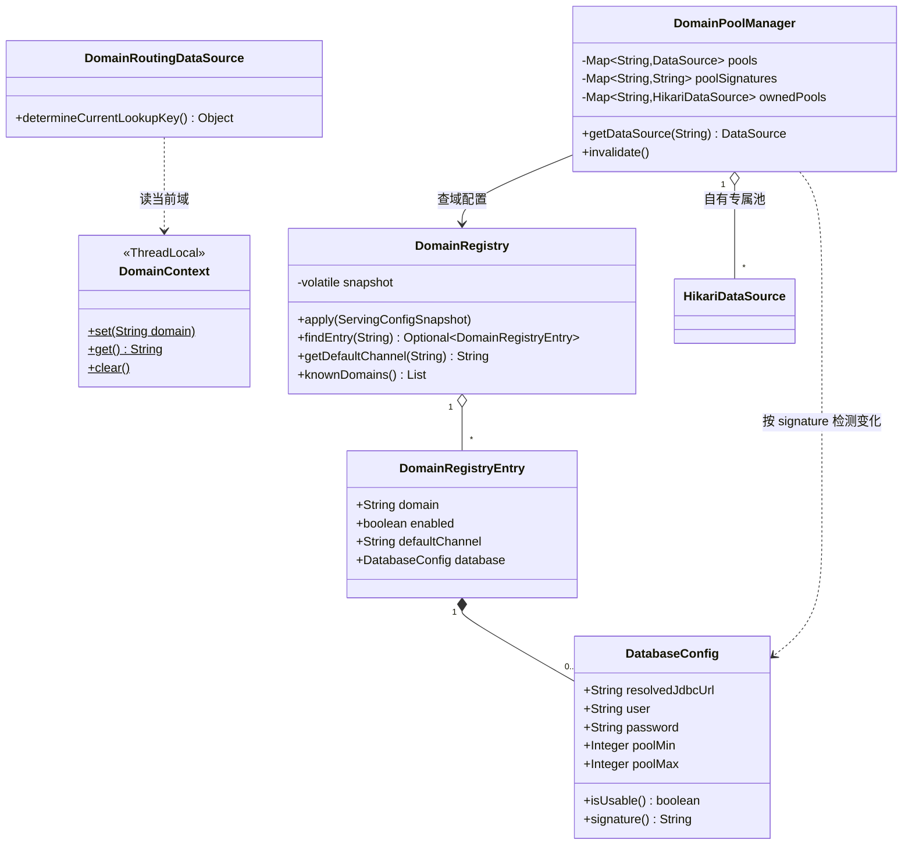
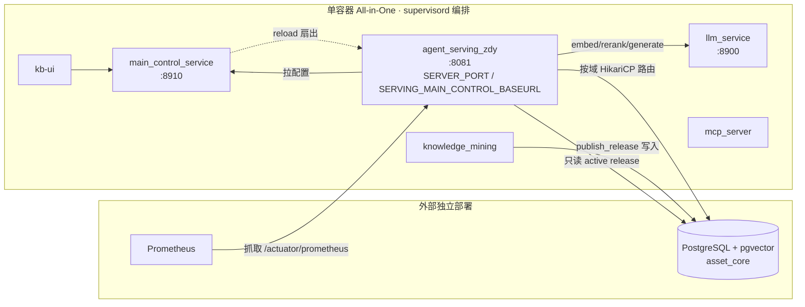

# agent_serving_zdy UML 图集

> 配套 `detailed-design.md`。所有图以 **Mermaid** 编写，可在 GitHub / IntelliJ / VS Code（Markdown Preview Mermaid）直接渲染。
> 含：① 组件/分层依赖图 ② 领域模型类图 ③ 策略模式类图 ④ 检索主链路时序图 ⑤ 配置热重载时序图 ⑥ 多域连接池路由类图 ⑦ 部署图。
> 编写日期：2026-06-15

---

## 1. 组件 / 分层依赖图（Component Diagram）

DDD 单向向内依赖；外部系统以虚线标注。

---

## 2. 领域模型类图（Domain Class Diagram）

核心不可变 `record`（`with*` 派生）。

---

## 3. 策略模式类图（Strategy Pattern）

三处可插拔点：召回 / 融合 / 重排。

---

## 4. 检索主链路时序图（`POST /api/v1/search`）

---

## 5. 配置热重载时序图

启动期 `@PostConstruct` 同样调 `reload()`；失败则降级为空配置（lenient），靠 reload 端点恢复。

---

## 6. 多域路由与连接池类图

---

## 7. 部署图（Deployment）

> 注：`Dockerfile` 的 `EXPOSE 8082` 为独立运行镜像遗留值；集成部署以 supervisord 注入的 **8081** 为准。

---

## 渲染与导出

- **GitHub / IDE**：直接预览本 `.md` 即渲染。
- **导出 PNG/SVG**：`mmdc -i uml-diagrams.md -o uml.png`（@mermaid-js/mermaid-cli），或贴到 mermaid.live。
- 如需 **PlantUML（.puml）** 版本或嵌入 `docs/html/` 的 HTML 页面，可另行生成。
